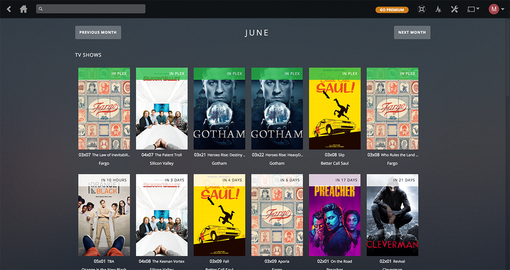
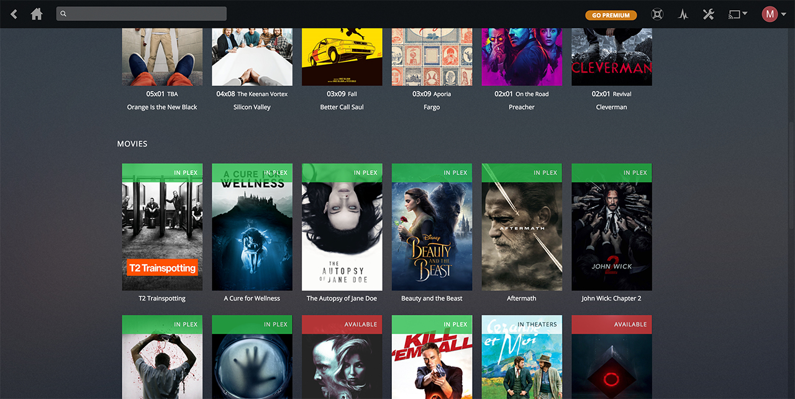

  

  
  

<h2 align="center"><a href="https://chrome.google.com/webstore/detail/naofhcnmmeadbnonficeccmbfibchcmb" target="_blank">Download for Google Chrome</a></h2>

<h2 align="center"><a href="https://chrome.google.com/webstore/detail/naofhcnmmeadbnonficeccmbfibchcmb" target="_blank">Download for Google Chrome</a></h2>

# Todo
- [x]  Option to add different url for Plex
- [x]  Have the option to enable/disable Radarr or Sonarr
- [x]  Filter tv and movies (available, in plex, theaters, etc)
- [ ]  Improve insert to navbar (sometimes fail)
- [ ]  Implement options page with React
- [ ]  Improve movies sorting
- [ ]  Being able to view available downloads when available
- [ ]  Being able to start download if available
- [ ]  Movie details
- [ ]  Tv details
- [ ]  Implement trakt.tv API for movie and tv recommendations and lists
- [ ]  Add new media to Sonarr and Radarr from trakt.tv results
- [ ]  Implement more overview views

# For developers
Use `npm start` to make webpack watch folder for changes.

Run `npm run prod` to make it production ready.

Run `npm run web` to make use of webpack dev server and run it like a normal webpage. This makes use of mock api
