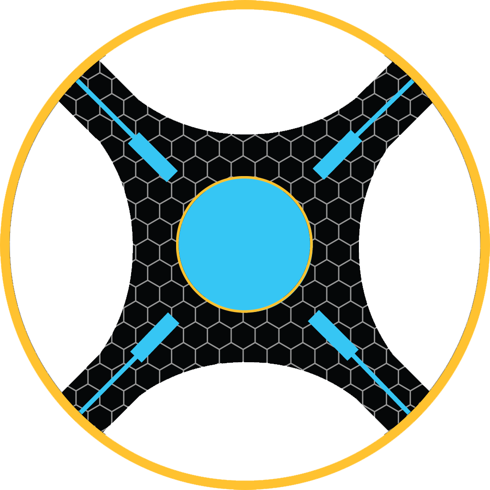
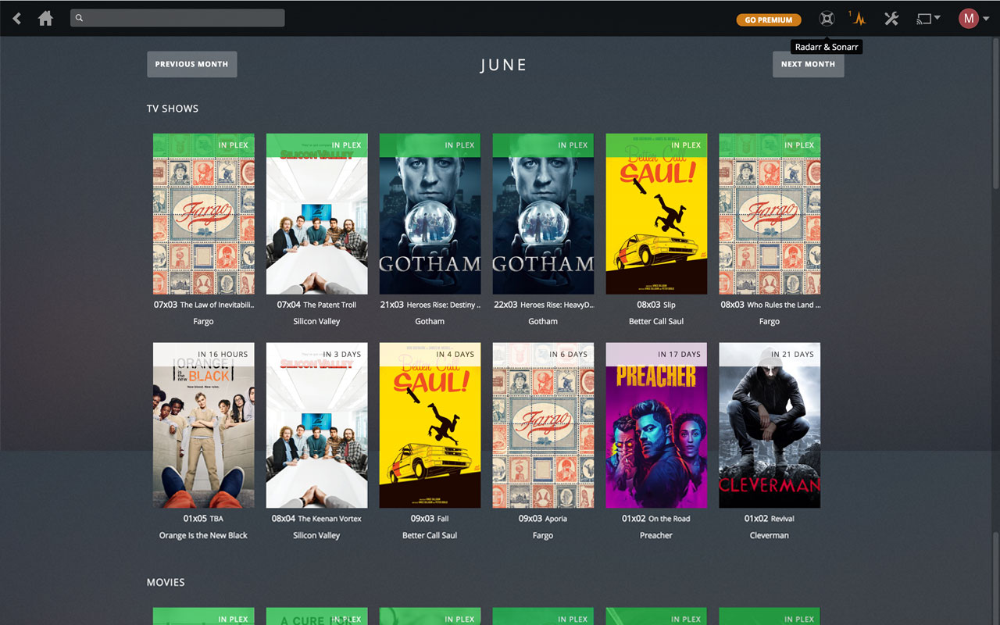

### [Download for Google Chrome](https://chrome.google.com/webstore/detail/naofhcnmmeadbnonficeccmbfibchcmb)

# Todo
- [ ]  Filter tv and movies
- [ ]  Improve insert to navbar (sometimes fail)
- [ ]  Make use of url base
- [ ]  Improve movies sorting

# For developer
Use `npm start` to make webpack watch folder for changes.

Run `npm run prod` to make it production ready.
