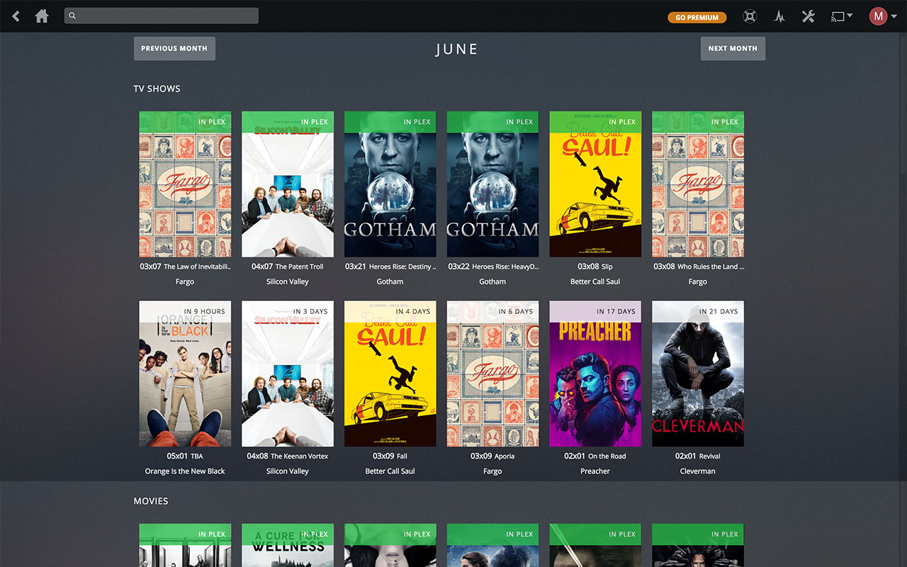

### [Download for Google Chrome](https://chrome.google.com/webstore/detail/naofhcnmmeadbnonficeccmbfibchcmb)

# Todo
- [x]  Option to add different url for Plex
- [ ]  Filter tv and movies (available, in plex, theaters, etc)
- [ ]  Improve insert to navbar (sometimes fail)
- [ ]  Improve movies sorting
- [ ]  Being able to view available downloads when available
- [ ]  Being able to start download if available

# For developer
Use `npm start` to make webpack watch folder for changes.

Run `npm run prod` to make it production ready.
